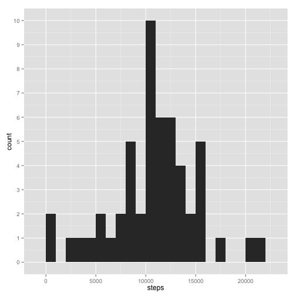
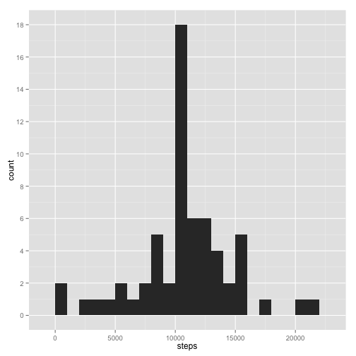

# Reproducible Research: Peer Assessment 1


## Loading and preprocessing the data

Required R libraries


```r
library(ggplot2)
library(scales)
```

"activity.zip" contains one file, "activity.csv", which is a CSV file of 17,568 
observations of three variables:

* steps:  Number of steps taking in a 5-minute interval (missing values are coded as ```NA```)
* date: The date on which the measurement was taken in YYYY-MM-DD format
* interval: Identifier for the 5-minute interval in which measurement was taken

Using the "unz" fuction, opened a connection to "activity.csv" inside the zip 
file and read it into the variable "data".


```r
con <- unz("activity.zip", "activity.csv")
data <- read.csv(con)
```


## What is mean total number of steps taken per day?

Histogram of the total number of steps taken each day.


```r
stepsPerDayDF <- aggregate(steps ~ date, data = data, sum, na.rm = TRUE)
ggplot(stepsPerDayDF, aes(steps)) + geom_histogram(binwidth = 1000) + 
  scale_y_continuous(breaks=pretty_breaks(n=10))
```

 

Mean total number of steps taken per day:


```r
mean(stepsPerDayDF$steps)
```

```
## [1] 10766
```

Median total number of steps taken per day:


```r
median(stepsPerDayDF$steps)
```

```
## [1] 10765
```


## What is the average daily activity pattern?

Average number of steps taken per 5-minute interval, averaged across all days.


```r
stepsPerIntervalDF <- aggregate(steps ~ interval, data = data, mean, 
                                na.rm = TRUE)
ggplot(stepsPerIntervalDF, aes(interval, steps)) + geom_line()
```

 

5-minute interval, on average across all days, with the maximum number of 
steps:


```r
stepsPerIntervalDF[stepsPerIntervalDF$steps == max(stepsPerIntervalDF$steps, 
                                                   na.rm = FALSE), ]
```

```
##     interval steps
## 104      835 206.2
```


## Imputing missing values

Total number of missing values in the dataset:

```r
ok <- complete.cases(data)
notOK <- sum(!ok)
notOK
```

```
## [1] 2304
```

As missing values may introduce some bias into the analysis, assume that the 
missing values is equal to the mean of that 5-minute interval.  Created new
dataset.


```r
imputedData <- data
for(i in 1:length(imputedData$steps)) {
  if (is.na(imputedData[i, 1])) {
    imputedData[i, 1] <- stepsPerIntervalDF[stepsPerIntervalDF$interval == 
                                              imputedData[i, 3], ]$steps
  }
}

## Sanity check
sum(!complete.cases(imputedData))
```

```
## [1] 0
```

Histogram of data with imputed values


```r
stepsPerDayWithImputedDF <- aggregate(steps ~ date, data = imputedData, sum, na.rm = TRUE)
ggplot(stepsPerDayWithImputedDF, aes(steps)) + geom_histogram(binwidth = 1000) + 
  scale_y_continuous(breaks=pretty_breaks(n=10))
```

 

Mean total number of steps taken per day using data with imputed values:


```r
mean(stepsPerDayWithImputedDF$steps)
```

```
## [1] 10766
```

As expected, since we used mean data to imput values, the mean of the total
data does not change.

Median total number of steps taken per day using data with imputed values:


```r
median(stepsPerDayWithImputedDF$steps)
```

```
## [1] 10766
```

Again, as expected, since we used mean data to imput values, the median of the 
total data moves towards the mean.

## Are there differences in activity patterns between weekdays and weekends?


```r
imputedData$weekday <- as.factor(ifelse(weekdays(as.POSIXct(imputedData$date)) %in% 
                                c("Saturday", "Sunday"), "Weekend", "Weekday"))
stepsPerIntervalWeekdayDF <- aggregate(steps ~ interval + weekday, data = imputedData, mean)
sp <- ggplot(stepsPerIntervalWeekdayDF, aes(interval, steps)) + geom_line()
sp + facet_grid(weekday ~ .)
```

 
